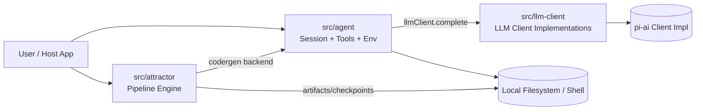

# OpenOxen

OpenOxen 是对 [strongdm/attractor](https://github.com/strongdm/attractor) 的实现，包含：
- Attractor Pipeline Engine
- Agent（基于 Coding Agent Loop 规范）
- LLM Client（当前内置 `pi-ai` 实现）

对应模块：
- `src/cli`：命令行入口（`openoxen dev`），负责生成并执行 pipeline
- `src/attractor`：DOT 解析、验证、执行引擎、节点处理器、checkpoint
- `src/agent`：Session 循环、Provider Profile、Tool Registry、本地执行环境、事件
- `src/llm-client`：LLM 客户端抽象实现集合（当前含 `pi-ai`）

调用关系（关键）：
- `attractor` 不直接调用 `pi-ai`
- `attractor` 的 codergen backend 通过 `agent` 的 `Session` 发起 LLM 调用
- `agent` 再通过 `llm-client`（`pi-ai` 实现）做统一 LLM 请求

## 环境要求

- Node.js `>= 22`（使用 `--experimental-strip-types` 直接运行 TypeScript 测试）
- npm `>= 10`

## 快速开始

```bash
npm test
```

本地直接运行 CLI（无需安装到全局）：

```bash
npm run cli -- dev "实现一个用户登录接口" --task user-login
```

OAuth 登录（pi 模块）：

```bash
npm run cli -- login
```

当前测试会覆盖：
- Attractor 核心行为（解析、校验、路由、goal gate、retry、human gate）
- Agent 核心行为（工具循环、截断、steering、loop detection）
- `llm-client` 的 `pi-ai` 实现 smoke tests

## 使用方式

### 0) CLI 入口（推荐）

```bash
openoxen dev "<需求>" [--task <name>] [--quiet|--verbose]
openoxen login [--provider <name>]
```

- 默认输出 DOT 文件：`openoxen.pipeline.<timestamp>.dot`（保存在当前目录）
- 指定 `--task` 后输出：`<task>.dot`（保存在当前目录）
- 命令会在生成 DOT 后立即运行 Attractor
- 默认 pipeline：测试用例编写 -> 开发 -> 代码检视 -> 测试
- 测试失败最多 5 轮后进入人工介入（可继续或中止）
- `openoxen login` 会触发 `llm-client/pi-ai` 的 OAuth 登录流程，默认 provider=`openai-codex`
- `openoxen dev` 默认输出运行追踪日志（可用 `--quiet` 关闭）：
  - OpenOxen 发给 agent 的阶段输入
  - agent 发给 LLM 的 request/messages/tools
  - LLM 返回文本与 tool calls
  - 工具调用开始/结束与工具输出

常用环境变量（OAuth / pi-ai）：
- `OPENOXEN_AUTH_FILE`：OAuth 凭证文件路径（默认 `~/.openoxen/auth.json`）
- `OPENOXEN_PI_PROVIDER`：覆盖 provider 到 `@mariozechner/pi-ai` 的映射
- `OPENOXEN_MODEL`：覆盖请求模型名
- `OPENOXEN_FAKE_PI=1`：启用本地假实现（测试/离线调试）
- `OPENOXEN_NO_BROWSER=1`：登录时不自动尝试打开浏览器
- `OPENOXEN_VERBOSE=0`：默认关闭 `openoxen dev` 的追踪日志
- `OPENOXEN_TRACE_PI=1`：打印 `llm-client/pi-ai` 实际发送给 `@mariozechner/pi-ai` 的 context/options（apiKey 自动脱敏）

依赖说明：
- OpenOxen 的 `llm-client/pi-ai` 底层直接调用 `@mariozechner/pi-ai`
- 首次使用请先安装依赖：`npm install`

常见 agent 工具（含 openclaw 风格别名）：
- 文件：`read_file/write_file/edit_file/apply_patch`，别名 `read/write/edit`
- 搜索：`grep/glob`，别名 `search/find`
- 目录：`ls/list_dir`
- 命令：`shell`，别名 `exec/bash/process(run)`
- 子 agent：`spawn_agent/send_input/wait/close_agent`

### 1) 运行 Attractor Pipeline

```ts
import { parseDot, runPipeline, createDefaultRuntime } from "./src/attractor/index.ts";
import { createPiAiClientAdapter, createPiAiCodergenBackend } from "./src/llm-client/pi-ai.ts";

const dot = `
digraph demo {
  graph [goal="Create hello world script"]
  start [shape=Mdiamond]
  plan [shape=box, prompt="Plan for: $goal"]
  done [shape=Msquare]
  start -> plan -> done
}
`;

const piClient = {
  async complete(req: any) {
    return { id: "1", text: "ok", tool_calls: [] };
  },
};

const llmClient = createPiAiClientAdapter(piClient);
const runtime = createDefaultRuntime({
  codergenBackend: createPiAiCodergenBackend(llmClient, {
    model: "gpt-5.2-codex",
    provider: "openai",
  }),
});

const result = await runPipeline(parseDot(dot), {
  logsRoot: "./.tmp/openoxen-run",
  runtime,
});

console.log(result.status, result.completedNodes);
```

### 2) 运行 Agent Session

```ts
import { Session, LocalExecutionEnvironment, createOpenAIProfile } from "./src/agent/index.ts";
import { createPiAiClientAdapter } from "./src/llm-client/pi-ai.ts";

const env = new LocalExecutionEnvironment({ workingDir: process.cwd() });
const profile = createOpenAIProfile();

const piClient = {
  async complete(request: any) {
    return { id: "r1", text: "done", tool_calls: [] };
  },
};

const session = new Session({
  providerProfile: profile,
  executionEnv: env,
  llmClient: createPiAiClientAdapter(piClient),
});

const result = await session.submit("Create a file hello.py");
console.log(result.text);
```

## 模块关系（架构图）



## 目录结构

```text
src/
  cli/        # openoxen dev / login commands
  attractor/   # DOT -> Graph -> Validation -> Runtime
  agent/       # Session + Tool Execution + Provider Profiles
  llm-client/  # LLM client implementations (pi-ai, ...)
tests/
  cli.test.ts
  attractor-core.test.ts
  attractor-engine.test.ts
  agent.test.ts
  integration-smoke.test.ts
docs/
  spec-parity-notes.md
```
